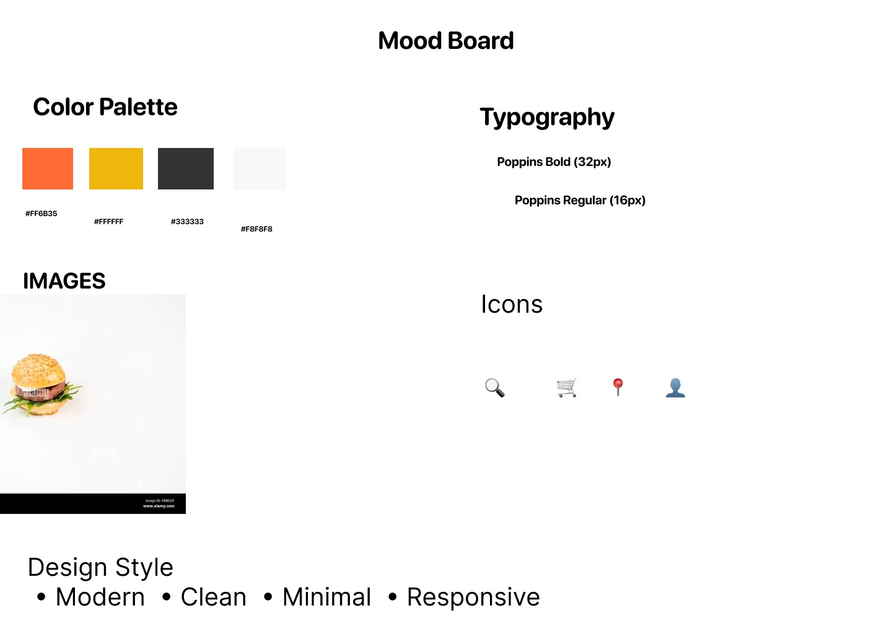
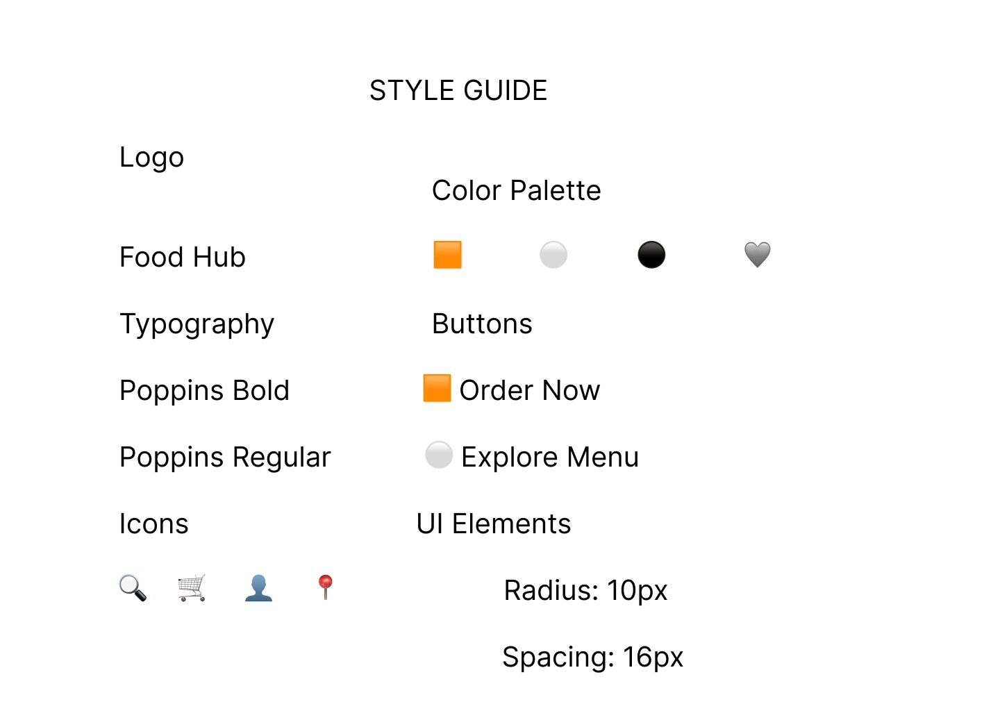
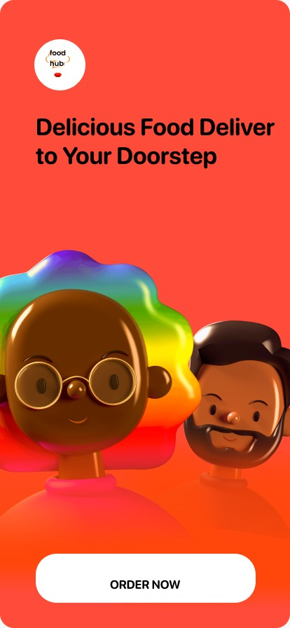

# 🍔 FoodHub Website UI Redesign

<p align="center">
  
  
  
</p>

## 📌 Project Overview

The **FoodHub Website UI Redesign** project focuses on redesigning an existing food delivery website to improve usability, accessibility, visual hierarchy, and responsiveness. The redesigned interface provides a clean, modern, and user-friendly experience for both desktop and mobile users.

---

## 🎯 Objectives

* Perform Heuristic Evaluation
* Identify usability issues
* Create a Mood Board
* Develop a Style Guide
* Design High-Fidelity Mockups
* Design Responsive Desktop UI
* Design Responsive Mobile UI

---

## 🛠️ Tools Used

* Figma
* GitHub

---

## 📋 Heuristic Evaluation

The existing website was evaluated using usability principles to identify design issues and improve the overall user experience.

### Identified Issues

* Cluttered homepage layout
* Inconsistent spacing
* Small call-to-action buttons
* Weak visual hierarchy
* Limited mobile responsiveness

### Proposed Improvements

* Better spacing and alignment
* Consistent typography
* Improved navigation
* Modern UI components
* Responsive layouts

### 📄 Heuristic Evaluation Report

[📥 View Heuristic Evaluation PDF](Heuristic_Evaluation_FoodHub.pdf)

---

## 🎨 Mood Board

The mood board defines the overall visual style of the redesign.

### Includes

* Color Palette
* Typography
* Icons
* UI Inspiration
* Visual Components

### Screenshot

<p align="center">

</p>

---

## 🎨 Style Guide

The style guide ensures consistency throughout the interface.

### Includes

* Primary Colors
* Secondary Colors
* Typography
* Buttons
* Cards
* Input Fields
* Icons
* Spacing System

### Screenshot

<p align="center">

</p>

---

## 💻 Desktop UI Design

The desktop interface includes:

* Navigation Bar
* Hero Banner
* Search Section
* Categories
* Food Cards
* Offers
* Footer

### Screenshot

<p align="center">

</p>

---

## 📱 Mobile UI Design

The responsive mobile interface includes:

* Mobile Navigation
* Search Bar
* Categories
* Food Cards
* Bottom Navigation

### Screenshot

<p align="center">

</p>

---

## 📄 Project Report

The complete project report explains the design process, research, usability improvements, and final UI redesign.

### Report

[📥 View Project Report](FoodHub_UI_Redesign_Project_Report.pdf)

---

## 📂 Repository Structure

```text
FoodHub-Website-UI-Redesign
│
├── README.md
├── Desktop UI.png
├── Mobile-UI.png
├── Mood-Board.png
├── Style-Guide.png
├── Heuristic_Evaluation_FoodHub.pdf
└── FoodHub_UI_Redesign_Project_Report.pdf
```

---

## ✨ Key Features

* Modern User Interface
* User-Centered Design
* Responsive Layout
* Clean Navigation
* Improved Visual Hierarchy
* Consistent Design System
* Better Accessibility
* Enhanced User Experience

---

## 🎯 Expected Outcome

This project demonstrates the complete UI/UX redesign process, including heuristic evaluation, mood board creation, style guide development, responsive interface design, and documentation using Figma.

---

## 👩‍💻 Author

**Gade Pavani**

UI/UX Design Internship Project

---

## ⭐ Support

If you like this project, consider giving it a ⭐ on GitHub.
